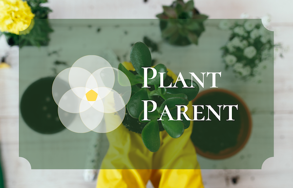

#### Purpose of the app:

This app is for users to manage the health and nutrition of their beloved plants. Whether they are just beginning their plant parenthood journey, or have been raising plants for years, this app is an invaluable tool for care.

#### How to use:

A user will create an account with an email address and password. The user will browse the list of available plant species and select the ones that they are growing. Once at least one plant has been selected, the user can view which plants they have assigned to their account. Users will be able to access info about the plant species and care instructions including watering, sunlight, and nutrient needs.

#### Upcoming Features planned for 3.0:

- Plants are added to the user's account database by name. Individual plant needs are broken down by user's geolocation tag and current weather patterns to advise them of when to water or fertilize a plant. App will display the amount of days remaining until it's time to water or fertilize a plant, e.g "Water me in two days", "Water me today!", "Feed me in 10 days."
- Arduino microcontroller integration. For example, a moisture sensor will give accurate, detailed information about water and soil needs.
- Users can name their plant, including taking a "baby photo" of their plant to document the growth of their little sprout.

## Site Preview

##### Home Page:

## Live Link

[Plant Parent](https://plantparent.netlify.app/)

## This site was built by:

[Amy Roy](https://github.com/MeerKatnip)

## Database and APIs used:

[Vegetable Plant API](http://highoncoding.com/vegetable/getcatalog)

[ElephantSQL](https://www.elephantsql.com/)

### Additional API for 3.0:

[OpenWeather API](https://openweathermap.org/api)

## Languages and Frameworks used:

JavaScript, React, Redux, Node.js, PostgreSQL, Bootstrap, Sequelize, Express

> Written by Amy Roy with [StackEdit](https://stackedit.io/).
